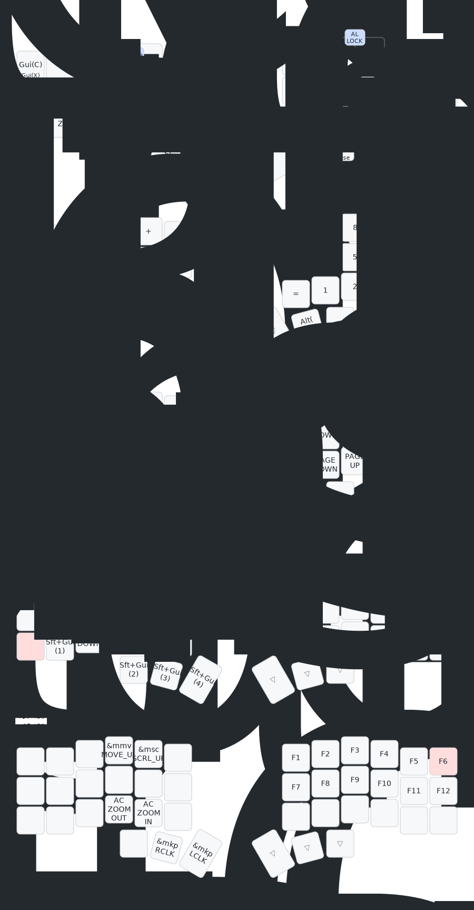

## ZMK
This is the zmk config for my corne.  

I figure it would be a good place to put some TODOs for improvement.  

### TODO
1. [DONE] ~~Homerow mod and combo~~
   - Right now I have 'rs' on homerow for both modifiers and tab combo. If both keys are pressed down (for long enough time), modifiers are the expected behavior. But now it's hitting tabs on repeat.  
2. Combo Key Ignore
   - Now when typing fast, sometimes _ and - combos didn't trigger, output st and en instead. In this case, I'd delete and press "st" to trigger combo again, but becuz of the required-idle-prior thingy, another "st" will just trigger again
   1. Hence, it'd probably be great to add space, backspace, delete to key ignore
   - Another problem is, for normal typing, if i wanna type "publish_stop" this kinda words, i'd have to purposely pause before hitting the combos; i think - and _ are really more commonly used than (), so might switch - _ with ()
   - Or just find a better way to trigger combos without intentional pausing. As () are heavily used in writing codes too.
3. Other Combos
   - I realize there're some keys that are kinda 'perfect' for combos, e.g., pb \ vd \ jl \ kh(only if i type khan), make them into combos?   

----  

### Keymap

