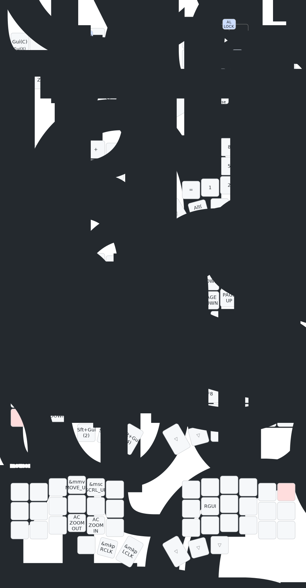

## ZMK
This is the zmk config for my corne.  

I figure it would be a good place to put some TODOs for improvement.  

### TODO
1. [DONE]Homerow mod and combo
   - Right now I have 'rs' on homerow for both modifiers and tab combo. If both keys are pressed down (for long enough time), modifiers are the expected behavior. But now it's hitting tabs on repeat.  
2. Combo Key Ignore
   - Now when typing fast, sometimes _ and - combos didn't trigger, output st and en instead. In this case, I'd delete and press "st" to trigger combo again, but becuz of the required-idle-prior thingy, another "st" will just trigger again
   - Hence, it'd probably be great to add space, backspace, delete to key ignore

----  

### Keymap

